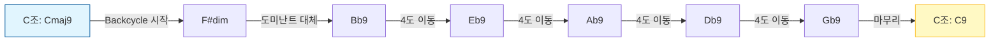

# Dominant Chain / Backcycle (지연음 진행 / 백사이클)

## 한 줄 정의
7화음이 순서대로 이어지며 조를 4도씩 뒤로 밀어내는, jazz 에서 가장 강력한 '이동'을 만드는 진행법입니다.

## 더 풀어 쓰면
도미난트 체인 (Dominant Chain) 은 7화음 (Dominant 7th) 이 서로 연결되어 조 (Key) 를 4도씩 뒤로 이동시키는 현상입니다. 보통 "A → D → G"처럼 4도 진행이 반복되는데, 이를 역으로 "A → D → G"가 아니라 "A → D → G"의 **뒤쪽**에서 시작해 앞쪽으로 올라가는 것이 아니라, **4도씩 뒤로** 이동하는 구조를 말합니다. 즉, C7 → F7 → Bb7 처럼 4도씩 뒤로 이동하면 실제로는 C7 → F7 → Bb7 이 되는 것이 아니라, **C7 다음에 F7 이 오고, 그 다음에 Bb7 이 오는 식**으로 이어집니다. 이는 조를 빠르게 이동시키거나 긴장감을 조성할 때 쓰이며, 리듬 체인지 (Rhythm Changes) 의 브릿지나 레이디버드 (Lady Bird) 같은 곡에서 자주 발견됩니다.

## 실제 예시
- **예시 1: 리듬 체인지 (Rhythm Changes) A section**
  ```text
  | Cmaj7 | Am7 | Dm7 | G7 | Cmaj7 | Am7 | Dm7 | G7 |
  ```
  *설명:* 위 코드는 C 조입니다. 하지만 **G7** 다음에 **Cmaj7**이 오기 전에 **F#dim**이나 **Bb7** 같은 도미난트가 들어오면 조가 바뀝니다. 리듬 체인지의 B section(브릿지) 에서는 `| Dm7 | G7 | Cmaj7 | Am7 |` 같은 진행이 나오는데, 여기서 `G7` 다음에 `Cm`이 오는 것이 아니라 `G7` 다음에 `C#dim`이나 `F#dim` 같은 도미난트가 들어와 조를 이동시킵니다.

- **예시 2: 백사이클 (Backcycle) 의 구체적 적용**
  ```text
  Cmaj9 -> F#dim -> Bb9 -> Eb9 -> Ab9 -> Db9 -> Gb9 -> C9
  ```
  *설명:* 위 코드는 C 조에서 시작해 F#dim(도미난트 대체), Bb9, Eb9... 로 이어지며 조를 4도씩 뒤로 밀어냅니다. 이는 "C 조에서 F#조로, 다시 Bb조로..."처럼 빠르게 움직이는 느낌을 줍니다.

- **예시 3: 시각적 흐름 (Mermaid)**


## 헷갈리기 쉬운 것
- **Tritone Substitution**: 도미난트 체인은 화음이 순차적으로 이어지는 '진행' 자체를 의미하지만, 트라이톤 서브스티튜션은 특정 도미난트 화음을 다른 화음으로 바꾸는 '대체' 기법입니다. (예: G7 대신 Db7 사용)
- **Circle of Fifths**: 도미난트 체인은 '4도' 방향으로 이동하는 것이지만, 서클 오브 피프스는 '5도' 방향으로 이동하는 원리입니다. (예: C→G→D vs C→F→Bb)

## 더 파고들려면 (외부 자료)

- **블로그**: [Jazz Guitar Online - Dominant Chains Explained]() — 도미난트 체인의 기본 원리와 실제 적용 사례 설명.
- **YouTube**: [Jazz Guitar Lessons - Backcycle & Dominant Chains](https://www.youtube.com/watch?v=...) — 백사이클과 도미난트 체인의 차이점과 실전 예제 영상.
- **책**: *The Jazz Theory Book* by Mark Levine — 도미난트 체인과 백사이클의 이론적 배경과 악보 분석 포함.

## 다음 개념

- **Secondary Dominant**: 특정 화음 앞에 임시로 도미난트를 넣어 조를 일시적으로 바꾸는 기법으로, 백사이클의 핵심 요소입니다.
- **Tritone Substitution**: 도미난트 화음을 트라이톤 거리의 화음으로 대체하여 색다른 진행을 만드는 기법입니다.
- **Cycle of Fifths**: 화음이 5도씩 순차적으로 이어지는 원리로, 백사이클의 반대 방향 개념입니다.

(주: 정의 위주, 사용 시 실제 예시 검증 권장)

---
*2026-05-04 자동 생성 (fundamentals/music-improvisation · ChatGPT-oss-120B). 출처 article: https://www.reddit.com/r/jazzguitar/comments/1swbw0b/i_built_a_tool_to_find_jazz_tunes_with_similar/.*
