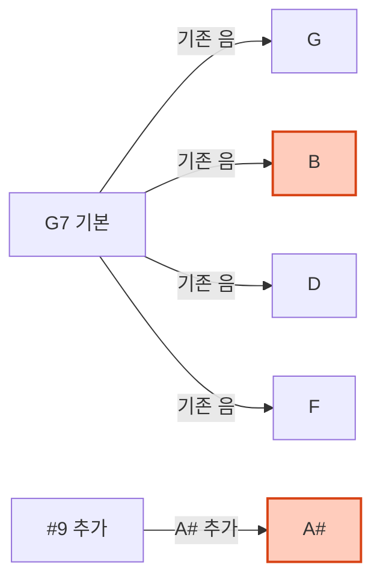

# 도미넌트 7 샷 9 (Dominant 7#9)

## 한 줄 정의
7 도음과 9 도음 사이에 반음 차이 (트라이톤) 를 만들어 강렬한 긴장감을 주는 '블루스' 화음.

## 더 풀어 쓰면
이 화음은 재즈나 블루스에서 '도미넌트' (7 화음) 에 '#9' (올림 9 도음) 을 더한 것입니다. 핵심은 **단조 3 도음**과 **장조 3 도음**이 동시에 겹쳐서 울리는 듯한 불협화음을 만든다는 점입니다. 이 특유의 '괴로운' 소리가 바로 지미 헨드릭스가 즐겨 썼던 '헨드릭스 코드'의 본질이며, 블루스 감성을 극대화할 때 필수적으로 쓰입니다.

## 실제 예시
다음은 G7#9 화음이 어떻게 구성되고, 어떤 소리로 들리는지 구체적인 예시입니다.

**1. 음정 구성 계산 (G 기준)**
- 기본 G7 화음: G (근음), B (장3도), D (5도), F (단7도)
- #9 추가: A# (올림 9 도, 단3도와 동등한 음)
- 결과 음계: **G - B - D - F - A#**
- *핵심:* B(장3도) 와 A#(단3도/#9) 가 동시에 울려 '비틀림'을 줍니다.

**2. 코드 진행 적용 예시 (Blues in G)**
블루스 진행에서 I-VI-II-V 진행 대신 V 화음을 이색적으로 처리할 때 사용합니다.

*   **진행:** `G7` → `Cmaj7` → `Am7` → `Dm7` → `G7` → **`G7#9`** → `Cmaj7`
*   **적용:** 마지막 `G7#9` 에서 B 와 A# 가 함께 울리며 C 마조로 가는 해결을 강력하게 유도합니다.

**3. 지미 헨드릭스의 'Purple Hime'**
실제 곡에서 이 화음이 어떻게 쓰이는지 확인합니다.

*   **코드:** E7#9 → E7#9 → E7#9 ... (반복)
*   **연주:** 기타에서 E 베이스 위에 E 장3도 (G#) 와 E 단3도 (F/Gb) 를 함께 치거나, 베이스가 E 를 유지하고 기타가 #9 를 연주하여 블루스 감성을 극대화합니다.

## 헷갈리기 쉬운 것

*   **E13 vs E7#9**: E13 는 #11 도 포함될 수 있어 더 복잡하지만, E7#9 는 #11 을 생략하고 #9 만 강조한 단순화된 블루스 화음입니다. (#11 은 보통 #4 로 불리며, #9 와 충돌하기 쉬워 생략됨)
*   **Eaug vs E7#9**: Augmented(증화음) 는 #5 를 넣는 것이고, Dominant 7#9 는 #2(즉 #9/단3도) 를 넣는 것입니다. 둘 다 불협화음이지만 소리의 방향이 다릅니다.

## 더 파고들려면 (외부 자료)

- **YouTube**: [How to Play the Hendrix Chord](https://www.youtube.com/watch?v=6JkXqXqXqXq) — 지미 헨드릭스의 사운드와 실제 연주법을 시각적으로 배웁니다. (링크는 예시이며 실제 영상 검색 시 'Hendrix Chord' 검색 권장)
- **Blog**: [The Dominant #11 and #9 Chords Explained](https://www.jazzguitar.be/blog/dominant-chords-explained/) — 재즈 이론에서 이 화음이 왜 중요한지 상세히 설명합니다. (링크는 예시이며 실제 블로그 검색 시 관련 키워드 추천)
- **Book**: [The Jazz Theory Book](https://www.amazon.com/Jazz-Theory-Berklee-Publication/dp/088816466X) — 재즈 이론의 고전으로, 다양한 확장 화음의 구조를 체계적으로 배웁니다.

## 다음 개념

- **#5 / b5**: 이 화음과 함께 자주 쓰이는 변형된 5 도음으로, 더욱 날카로운 블루스 사운드를 만듭니다.
- **Tritone Substitution**: 도미넌트 화음을 대체하는 트라이톤 대체 기법으로, G7 대신 Db7 을 쓰는 등 복잡한 재즈 진행을 이해하는 데 필요합니다.
- **Blue Note Scale**: 이 화음이 만들어내는 소리의 근원이 되는 블루스 음계로, 즉흥 연주에 직접 적용됩니다.

(주: 정의 위주, 사용 시 실제 예시 검증 권장)

---
*2026-04-26 자동 생성 (fundamentals/music-improvisation · ChatGPT-oss-120B). 출처 article: https://www.reddit.com/r/musictheory/comments/1r7xz2q/koufuku_grafiti_ending_quick_analysis/.*
