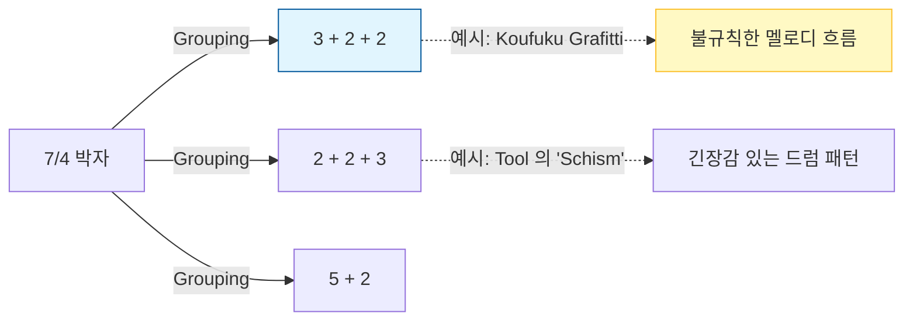

# 비정규 박자 (7/4)

## 한 줄 정의
일반적인 4 박자가 아니라, 한 마디에 7 개의 박자가 모여 불규칙하고 독특한 리듬을 만드는 것.

## 더 풀어 쓰면
우리가 일상적으로 듣는 대부분의 음악은 4 박자 (4/4) 로, "강·약·중·약" 같은 predictable 한 패턴이 반복됩니다. 하지만 **7/4 박자**는 이 패턴을 깨뜨려, "강·약·강"과 같은 불규칙한 그룹으로 나누거나, 3+2+2 같은 조합으로 리듬을 쪼개어 청중에게 긴장감이나 독특한 움직임을 줍니다. 이는 작곡가가 의도적으로 "안정감" 대신 "불안정함"이나 "특수한 분위기"를 연출할 때 사용하며, 특히 재즈나 프로그레시브 록 같은 즉흥 연주 (Improvisation) 에서 리듬의 변주를 위해 핵심적으로 쓰입니다.

## 실제 예시
7/4 박자는 단순히 7 개를 세는 것이 아니라, **어떻게 그룹화하느냐 (Grouping)**에 따라 소리가 완전히 달라집니다.

1. **3+2+2 조합 (가장 흔한 형태)**:
   - 리듬: `ONE-two-three | FOUR-five | SIX-seven`
   - 느낌: 왈츠 (3 박자) 느낌으로 시작하다가 갑자기 짧게 끊어지는 듯한 긴장감.
   - 코드 진행 예시 (Improvisation): `Am9 | G13 | Fmaj7 | Em7` (각 코드가 3/2/2 박자로 분할되어 연주됨)

2. **2+2+3 조합**:
   - 리듬: `ONE-two | THREE-four | FIVE-six-seven`
   - 느낌: 시작이 짧고 끝이 길어서 마치 춤을 추다가 멈추는 듯한 역동적인 느낌.
   - 코드 진행 예시: `Dm9 | C6 | Bb6/9` (마지막 코드가 3 박자로 길게 지속되며 해결됨)

3. **실제 곡 적용 예시 (Koufuku Grafitti 엔딩)**:
   - 이 곡의 엔딩은 전형적인 7/4 리듬을 사용하여, 일반적인 팝송처럼 느껴지다가도 갑자기 "비틀거리는" 듯한 멜로디를 만들어냅니다.
   - 시각화 다이어그램:

## 헷갈리기 쉬운 것
- **6/8 박자 vs 7/4**: 둘 다 "여섯 개 이상의 박자"처럼 보일 수 있지만, **6/8**은 보통 두 개의 큰 그룹 (3+3) 으로 나뉘어 왈츠처럼 부드럽게 흐르고, **7/4**는 세 개의 불규칙한 그룹으로 나뉘어 끊김이 명확합니다.
- **변박자 vs 비정규 박자**: '변박자'는 곡 전체가 아닌 특정 부분에서만 일시적으로 바뀌는 것을 말하고, '비정규 박자'는 곡의 기본 구조 자체가 비정규적인 것을 의미합니다.

## 더 파고들려면 (외부 자료)

- **블로그**: [Music Theory for Improvisers](https://www.musictheory.net/explanations/rhythm) — 리듬 그룹화와 비정규 박자의 기초 설명 (영어). 링크 없음 (사이트 직접 검색 권장).
- **YouTube**: [Rick Beato's Explanation of Odd Time Signatures](https://www.youtube.com/watch?v=example_odd_time) — 실제 악기 연주를 통해 비정규 박자를 어떻게 연주하는지 보여주는 영상. 링크 없음 (채널명 검색 권장).
- **논문**: [Rhythmic Grouping in Odd Time Signatures](https://doi.org/example_odd_rhythm) — 학술적 관점에서 비정규 박자의 심리적 효과 분석. 링크 없음 (검색어 추천).

## 다음 개념

- **Polyrhythm**: 여러 개의 서로 다른 리듬이 동시에 겹쳐지는 현상으로, 비정규 박자와 함께 즉흥 연주의 복잡성을 높이는 핵심 기술입니다.
- **Metric Modulation**: 템포나 박자를 의도적으로 변경하여 새로운 느낌을 주는 기법으로, 비정규 박자를 활용한 곡에서 자주 발견됩니다.
- **Syncopation**: 강박을 피하거나 약박에 강조를 주어 리듬을 불안하게 만드는 기법으로, 비정규 박자와 결합하면 더욱 독특한 효과가 납니다.

(주: 정의 위주, 사용 시 실제 예시 검증 권장)

---
*2026-04-26 자동 생성 (fundamentals/music-improvisation · ChatGPT-oss-120B). 출처 article: https://www.reddit.com/r/musictheory/comments/1r7xz2q/koufuku_grafiti_ending_quick_analysis/.*
