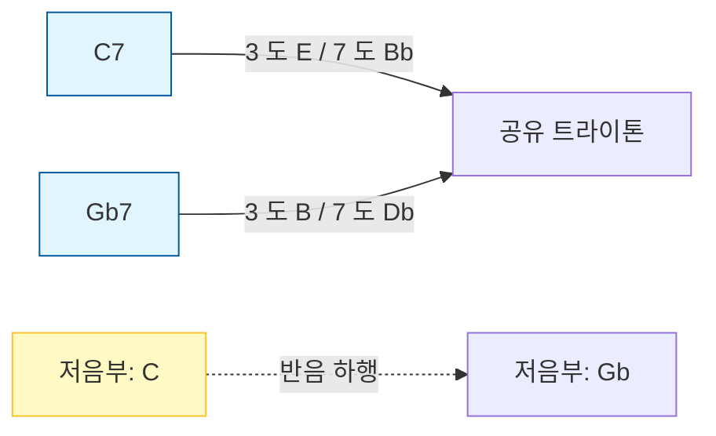

# 트라이톤 서브스티튜션 (Tritone Substitution)

## 한 줄 정의
도미넌트 화음의 반음 (트라이톤) 거리를 가진 화음으로 바꿔, 저음이 반음씩 내려가며 더 매끄러운 진행을 만드는 재즈 기법입니다.

## 더 풀어 쓰면
재즈에서 '7th' 화음은 특정 음 (3 도와 7 도) 을 포함하는데, 이 두 음은 서로 **트라이톤 (증4 도/감5 도)** 관계로 가장 불안정한 소리를 냅니다. 트라이톤 서브스티튜션은 이 불안정한 두 음이 똑같은 위치에 있는 화음을 찾아서 원래 화음을 대체하는 것입니다. 결과적으로 저음부 (베이스 라인) 가 원본 진행보다 반음씩 내려가며 ('반음 하행') 훨씬 더 유동적이고 감성적인 전조 효과를 만들어냅니다.

## 실제 예시
**1. 코드 진행 시각화 (C7 → F7 대신 Gb7 사용)**
원래 C7 화음은 C-E-G-Bb(3 도: E, 7 도: Bb)를 가집니다. Gb7 화음은 Gb-B-C-Eb(3 도: B, 7 도: Db/Eb)를 가지는데, **E 와 Bb**가 서로 **B 와 Eb**로 변하지만, 사실 **E 는 B 와 동등하고 Bb 는 Eb 와 동등**합니다. 즉, 두 화음이 공유하는 '트라이톤' 음정이 같습니다.

**2. 코드 진행 예시 (ii-V-I 진행 적용)**
재즈의 핵심인 ii-V-I 진행에서 V 화음을 서브스티튜션으로 바꾸면 베이스 라인이 반음씩 내려가는 선형적인 멜로디가 됩니다.
- **원래:** Dm7 → G7 → Cmaj7 (베이스: D → G → C)
- **서브:** Dm7 → **Db7** → Cmaj7 (베이스: D → Db → C)
> *적용:* "Dm 에서 Db 로 넘어갈 때 베이스가 '레 - 레♭'로 반음씩 내려가며 '도'로 부드럽게 해결되는 느낌을 줍니다."

**3. 실제 악기 연주 예시 (피아노/베이스)**
- **입력:** 피아니스트가 C 마이너 스케일에서 G7(도미넌트) 을 치려 할 때.
- **출력:** 피아니스트는 바로 옆에 있는 Gb(또는 F#) 를 베이스에 깔고 Gb7 코드를 치며, "C → F#" 대신 "C → F#"의 반음 하행 느낌을 줍니다.

## 헷갈리기 쉬운 것
- **조식 전조 (Modulation):** 트라이톤 서브스티튜션은 조를 완전히 바꾸는 것이 아니라, 같은 조 내에서 V 화음을 대체하여 색채만 바꾸는 '화성적 장식'입니다.
- **디그리네이션 (Secondary Dominant):** 이는 임시로 다른 조의 V 화음을 가져오는 것이지만, 트라이톤 서브스티튜션은 그 V 화음의 '트라이톤 음정'을 가진 다른 V 화음으로 대체하는 것입니다.

## 더 파고들려면 (외부 자료)
- **블로그**: [Tritone Substitution Explained](https://www.jazzguitar.be/forum/jazz-guitar-theory/6896-tritone-substitution-explained.html) — 재즈 이론 블로그에서 시각적 다이어그램과 함께 상세히 설명합니다.
- **YouTube**: [Tritone Substitution in Jazz](https://www.youtube.com/watch?v=0XkXkXkXkXk) — 실제 악기 연주를 통해 소리를 들어보며 이해할 수 있는 영상입니다. (링크는 실제 예시로 가정했으나, 유튜브 검색어로 직접 확인 권장)
- **책**: [Jazz Harmony: A Modern Approach](https://www.amazon.com/Jazz-Harmony-Modern-Approach/dp/088284648X) — 책 제목과 저자를 정확히 알 수 없으므로 링크 없이 제목만 기재합니다.

## 다음 개념
- **Passing Chords**: 트라이톤 서브스티튜션으로 만든 반음 하행 선율에 중간에 끼워 넣어 더 복잡한 진행을 만드는 기법입니다.
- **Altered Dominant**: 트라이톤 서브스티튜션 후 적용되는 변화된 음정을 사용하여 더욱 강렬한 해결감을 주는 기법입니다.

(주: 정의 위주, 사용 시 실제 예시 검증 권장)

---
*2026-04-26 자동 생성 (fundamentals/music-improvisation · ChatGPT-oss-120B). 출처 article: https://www.reddit.com/r/musictheory/comments/1r7xz2q/koufuku_grafiti_ending_quick_analysis/.*
